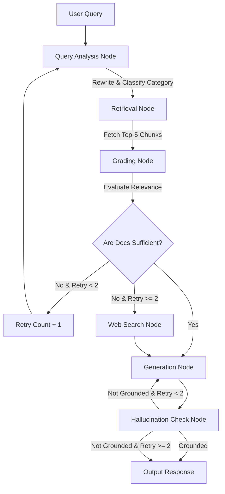

# FirstAidAI [SurakshaSetu]

**A production-ready, self-corrective RAG-powered First Aid AI Assistant and Gradio Dashboard.**

Get clear, actionable, step-by-step first aid procedures grounded in official medical manuals, with fallback to real-time search and built-in hallucination checks.


---


## What It Does

FirstAidAI helps users handle medical emergencies by providing quick, easy-to-read, step-by-step instructions. The assistant pulls information directly from trusted local medical PDF documents, validates references to ensure safety, and falls back to Google/Tavily web search when local manuals do not cover the situation.

### Key Capabilities

| Capability | How It Works |
|---|---|
| **Step-by-Step Guidance** | Guides the user through clear, numbered first aid instructions using active verbs and highlighting safety warnings (e.g. *DO NOT apply ice*). |
| **Self-Corrective RAG** | Evaluates document relevance and rewrites queries automatically if local manuals don't contain sufficient details. |
| **Web Search Fallback** | Integrates Tavily search to fetch the latest guidelines if local PDF manuals are insufficient. |
| **Gradio Dashboard** | Provides a web UI with input/output boxes on the left, and metadata (Category, Grounding status, Web Search state) on the right. |
| **FastAPI Backend** | Exposes REST endpoints to integrate with mobile apps, Telegram bots, or other services. |

---

## System Architecture

The core of FirstAidAI is built using **LangGraph**, routing queries dynamically based on document relevance and validation.



---

## Technical Write-Up & Decisions

### 1. Thought Process & Core Workflow
We used a **self-corrective loop (CRAG)** to avoid sending irrelevant, noisy information to the generation layer. Medical queries require high accuracy. By grading each retrieved document segment before generation, we filter out irrelevant material. When local documentation does not satisfy the query, the agent rewrites the prompt and queries Tavily Search for standard medical guidelines.

### 2. Chunking & Embedding Strategy
- **Embedding Model:** `all-MiniLM-L6-v2` via HuggingFace (running locally) to bypass API costs/limits on high-volume document ingestion.
- **Chunking:** `RecursiveCharacterTextSplitter` with `chunk_size=1000` and `chunk_overlap=200`. This ensures that instructions, which usually span multiple paragraphs, are kept together while preserving boundary context.

### 3. Design Decisions & Tradeoffs
- **Python-Calculated Metrics vs LLM Logic:** All routing parameters, retry limits, and document count stats are handled by deterministic Python logic rather than LLM reasoning, keeping the execution path fast and predictable.
- **Web Search Fallback:** When local documents yield no relevant matches, the agent automatically triggers Tavily Web Search. This ensures that the user is never left without guidance in an emergency.

---

## Setup & Installation

### Prerequisites
- Python 3.12+
- A Google Gemini API key (from [Google AI Studio](https://aistudio.google.com))
- A Tavily API key (optional, for web search fallback)

### Installation Steps

```bash
# Clone the repository
git clone https://github.com/A-Square8/NyayaSetu.git
cd NyayaSetu

# Create and activate virtual environment
python -m venv venv
source venv/bin/activate

# Install dependencies
pip install -r requirements.txt

# Create .env from the template
cp .env.example .env
# Edit .env and enter your actual GOOGLE_API_KEY and TAVILY_API_KEY
```

---

## Running the Application

### 1. Embed Document Corpus
Ensure you have your medical manuals (PDFs) inside `data/docs`. To clear any older documents and embed the new ones:
```bash
python src/ingest.py
```

### 2. Run the Gradio Dashboard
Starts the white/orange web user interface:
```bash
python dashboard.py
```
*Access the interface at `http://localhost:7860`.*

### 3. Run the FastAPI Server
Starts the backend endpoints:
```bash
python -m uvicorn app:api --reload --port 8000
```

### 4. Run Verification Suite
Runs offline verification or query test files:
```bash
python test.py
python test_api.py
```

---

## Example API Requests & Responses

### Query Endpoint (`POST /query`)

#### Request
```json
{
  "question": "What are the first aid steps for a second-degree burn?",
  "session_id": "test_session_01"
}
```

#### Response
```json
{
  "answer": "1. **Cool the Burn**: Run cool, clean water over the area for at least 10 minutes.\n2. **Protect the Blisters**: Do not break any blisters as it increases infection risk.\n3. **Cover Loosely**: Apply a sterile, non-adherent bandage.\n\n*Source: FirstAidManual.pdf*",
  "sources": ["FirstAidManual.pdf"],
  "category": "burns",
  "session_id": "test_session_01",
  "web_search_used": false
}
```

---

## Future Roadmap & Improvements
- **Voice Activation:** Integrate speech-to-text (Whisper) for hands-free usage during emergencies.
- **Emergency Action Triggers:** Add a button to instantly locate the nearest hospital/clinic using browser geo-location.
